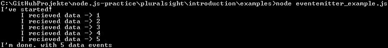

Events and Streams
==================

What's the difference between Callbacks and Events?

**Callbacks**
```js
getThem(param, function(err,items) {
  // check for error
  // operate on array items
});
```
* No results until all results
* Complete result, or error

**Events**
```js
var results = getThem(param);
results.on('item', function(i) {
  // do something with this one example
});
results.on('done', function(i) {
  // no more items
});1
results.on('error', function(i) {
  // React to error
});
```
* Act on each result when it arrives
* Partial result before error

##EventEmitter
To emit such events in your own modules you have to know this EventEmitter-Class

First of all you need to require this module. `var EventEmitter = require('events').EventEmitter;` Then you have to create your function
that has one or more events.

**eventemitter_example1**
```js
var EventEmitter = require('events').EventEmitter;

var getResources = function(number) {
  var e = new EventEmitter();             // Now we can emit/fire some events over this e-variable
  process.nextTick(function() {
    /* With this process.nextTick we can be sure, that the included function starts AFTER returning e,
       now this function runs asynchronous */
    var counter = 0;
    e.emit('start');                      // Now we emited/fired the "start event"
    var interval = setInterval(function() {
      e.emit('data',++counter);           // Now we emited/fired the "data event"
      if(counter === number) {
        e.emit('end',counter);            // Now we emited/fired the "end event"
        clearInterval(interval);          // We have to "kill" the interval
      }
    },100);
  });
  return(e);
}

var result = getResources(5);             // Now we have this function and the function in process.nextTick is going to run

result.on('start',function() {            // The emitted "start event" is caught and runs the following function
  console.log('I\'ve started!');
});

result.on('data',function(d) {            // The emitted "data event" is caught and runs the following function
  console.log('     I received data -> ' + d);
});

result.on('end',function(d) {             // The emitted "end event" is caught and runs the following function
  console.log('I\'m done, with ' + d + ' data events');
});
```

Download [this file](examples/eventemitter_example1.js) and run it with `node eventemitter_example.js` and you should get this:


####Outsourced :wink:
If you want to create a module and emit some events from there, you need a key-row in your module:
**eventemitter_example2-a.js**
```js
var Resource = require('./eventemitter_example2-b.js');
var result = new Resource(5);
/* Now we have this function and the function in process.nextTick is going to run
   Now we need to generate an instance of this module here */

result.on('start',function() {            // The emitted "start event" is caught and runs the following function
  console.log('I\'ve started!');
});

result.on('data',function(d) {            // The emitted "data event" is caught and runs the following function
  console.log('     I received data -> ' + d);
});

result.on('end',function(d) {             // The emitted "end event" is caught and runs the following function
  console.log('I\'m done, with ' + d + ' data events');
});
```
download [here](examples/eventemitter_example2-a.js)

**eventemitter_example2-b.js**
```js
var util = require('util');
var EventEmitter = require('events').EventEmitter;

function Resource (number) {
  var self = this;                        // 'this' is an instance of EventEmitter by itself, we don't need to define a new one.
  process.nextTick(function() {
    var counter = 0;
    self.emit('start');
    var interval = setInterval(function() {
      self.emit('data',++counter);
      if(counter === number) {
        self.emit('end',counter);
        clearInterval(interval);
      }
    },100);
  });
}

util.inherits(Resource, EventEmitter);    // Resource inherits now from EventEmitter
module.exports = Resource;
```
download [here](examples/eventemitter_example2-b.js)

##Streams

***
[visit the course :rocket:](http://www.pluralsight.com/courses/node-intro) - [go to the README of **pluralsight** :books:](../README.md)

[:arrow_left: Previous Module](modules_require_npm.md) | [Next Module :arrow_forward:](local_system.md)
