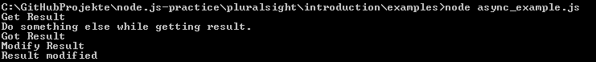

Getting Started with Node.js
============================

Node.js is a server-side JavaScript platform, invented by Ryan Dahl.

It's basing on three points:
* libuv, is a high performance, cross-plattform evented i/O Library
* Google's V8-JavaScript engine
* JS and C++, specifically developed for itself.

##After installation

If you have installed **Node.js** you can start it over your console like this `node`. After this command, node will start and you're able to communicate with it. For example just type in `console.log('Hello World')` and you will get `Hello World`.

##First file
Now we should create a file with this content:
#####timeout.js
```js
setTimeout(function() {
  console.log('world');
},1000);
console.log('Hello');
```

Run it with `node timeout.js` and you'll get `Hello` and after one second, `world` will appear.

> What we are doing here is using the node.js eventloop. These two statements are called async an that's it why the `Hello` appears before the `world`.

##First web-server

Now we want to setup a small web-server on our localhost.
#####server.js
```js
var http = require('http');
http.createServer(function (req, res) {
  res.writeHead(200, {'Content-Type': 'text/plain'});
  res.end('Hello World\n');
}).listen(1337, "127.0.0.1");
console.log('Server running at http://127.0.0.1:1337/');
```
Run it with `node server.js` and open your browser and visit the printed [URL](http://127.0.0.1:1337/).

##Writing asynchronous code
Maybe you developed like this until now.
```js
var result = doSomethingAndReturnSync();
var content = afterDoSomethingGetContentSync(result); //  This function don't start until doSomethingAndReturn has returned.
console.log(content);
doSomethingElseSync();
```
This kind is called **synchronous programming** because the code runs step by step.

With **asynchronous programming** this is better managed.
```js
doSomethingAndReturnAsync(function(error,result) {
  if(!error) {
    afterDoSomethingGetContentAsync(result, function(error,content) {
      if(!error) {
        console.log(content);
      }
      else {
        console.error('An error occured, while getting content');
      }
    });
  }
  else {
    console.error('An error occured, while getting result');
  }
});
doSomethingElseAsync();
```
Now we are programming with **callbacks**. A callback is a function that's called after a finished task. The advantage of 'working with callbacks' is, that the code don't have to wait for something. The method `doSomethingElseAsync()` could be called while `doSomethingAndReturnAsync()` **is still running**, but the method `afterDoSomethingGetContentAsync()` is waiting for the result.

As a practical example download [this file](examples/async_example.js) and run it on node.


Now you should understand these pattern.

***
[visit the course online :rocket:](http://www.pluralsight.com/courses/node-intro) - [go to the README of **pluralsight** :books:](../README.md)

[Next Module :arrow_forward:](modules_require_npm.md)
