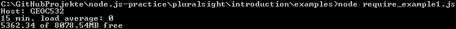
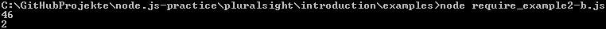

Modules, require() and NPM
==========================

Now we will learn how to include modules in our node-application.

###require()
The `require()`-function imports a module to our application. Modules can export variables, functions or objects.
```js
var foo = require('foo');
var Bar = require('bar');

var justOne = require('largeModule').justOne; // Imports just one function of a large module

var f = 2 + foo.alpha;                        // an exported variable
var b = foo.beta() * 3;                       // an exported function
var bar = new Bar();                          // an exported object

console.log(justOne());
```

There are three type of modules we can use.
* Built-In Modules
* Your project files
* Third party Modules (NPM)

####Built-In Modules
They are pre-packaged in Node and required with a simple string identifier
  * fs (FileSystem)
  * http (HTTP)
  * os (OperatingSystem)

**Example for requiring a built-in module**
```js
var os = require('os');

var toMb = function(f) {
  return(Math.round((f/1024/1024)*100)/100)
}

console.log('Host: ' + os.hostname);
console.log('15 min. load average: ' + os.loadavg()[2]);
console.log(toMb(os.freemem()) + ' of ' + toMb(os.totalmem()) + 'MB free');
```

Download this file [here](examples/require_example1.js) and run it with `node require_example1.js` and you should get something like this:


####Your project files
Each .js-file is a module and can be required by other files. So it's a great way to modularize your application. To require them with
system-like semantics

```js
var data = require('./data');
var foo = require('./other/foo');
var bar = require('../lib/bar');
```

To export a variable or function from your own module, you have to marke them with export via `module.exports`.
**Example for export a variable and a function**
```js
var count = 2;
var foo = 'Foo';
var doIt = function(i,callback)
{
   callback(null,i*count);
}

module.exports.doIt = doIt;
module.exports.count = count;
```

now we want to use this module:
**Example for require our exported variable and function**
```js
var one = require('./require_example2-a');

one.doIt(23,function(err,result) {
  if(!err) {
    console.log(result);
  }
});

console.log(one.count);
```

Now download the [module-file](examples/require_example2-a.js) and the [program-file](examples/require_example2-b.js) run the programm file with
`node require_example2-a.js` and you should get something like this:


Now take a look into these two files and try to understand why `console.log(one.foo);` will not going to work.

Correct, because it's no exported. To use this variable out of this module we need to export it with this: `module.exports.foo = foo`;
If you want to use a module variable that's not exportet you'll get an `undefined`.

###NPM
To install a new module we use `npm install moulde_name`. After that we can use them like a built-in module.

***
[visit the course :rocket:](http://www.pluralsight.com/courses/node-intro) - [go to the README of **pluralsight** :books:](../README.md)

[:arrow_left: Previous Module](getting_started.md) | [Next Module :arrow_forward:](events_streams.md)
